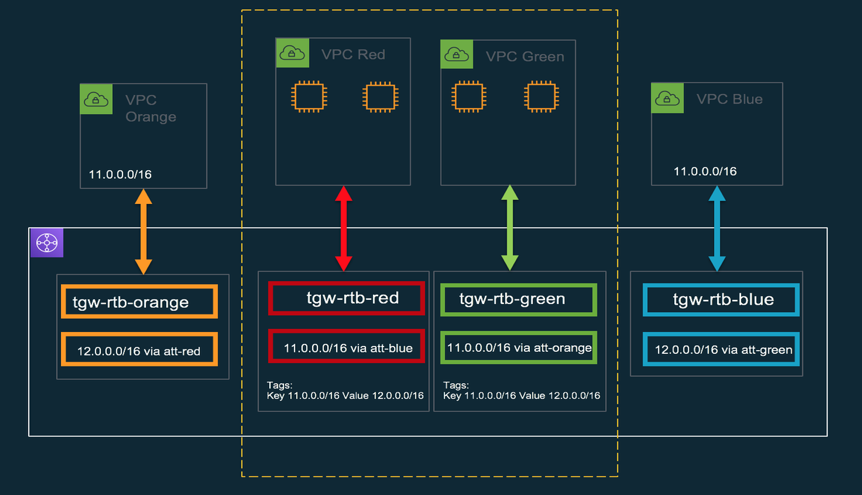
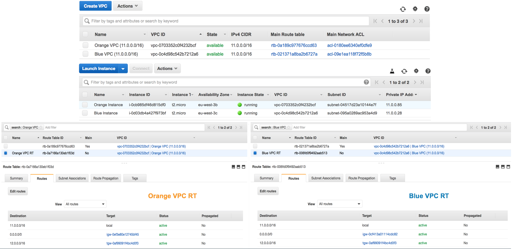
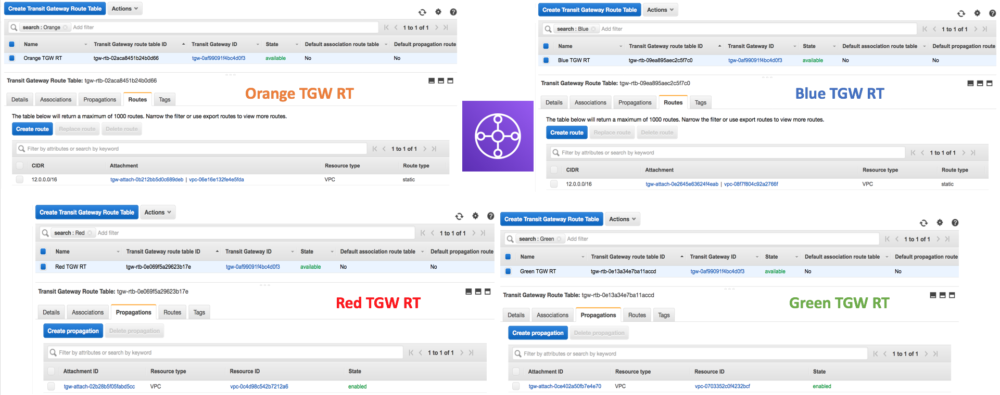
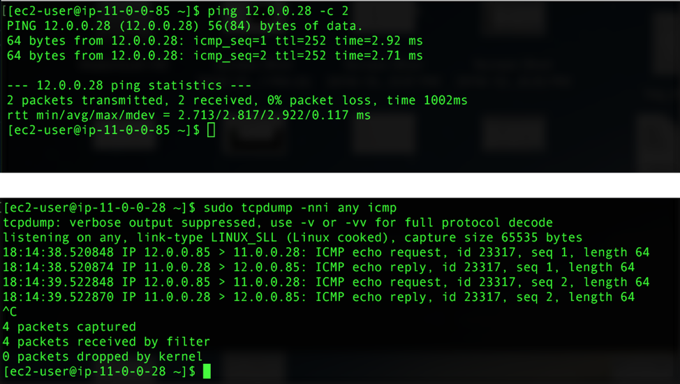
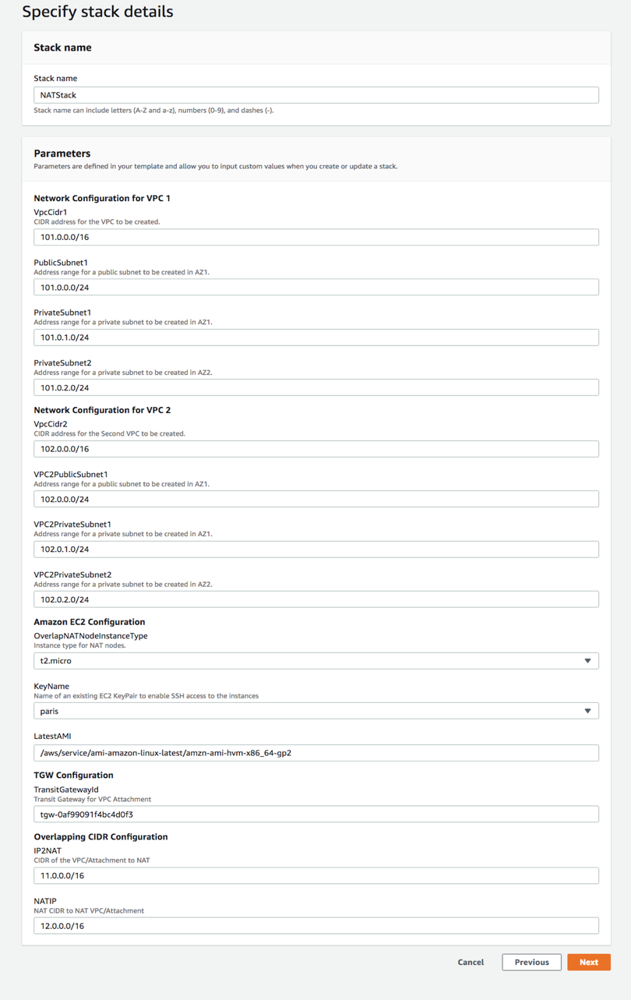
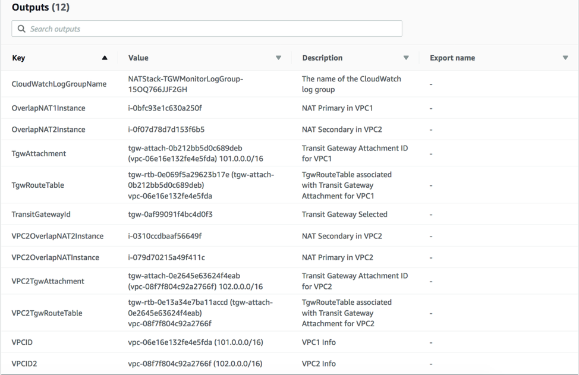
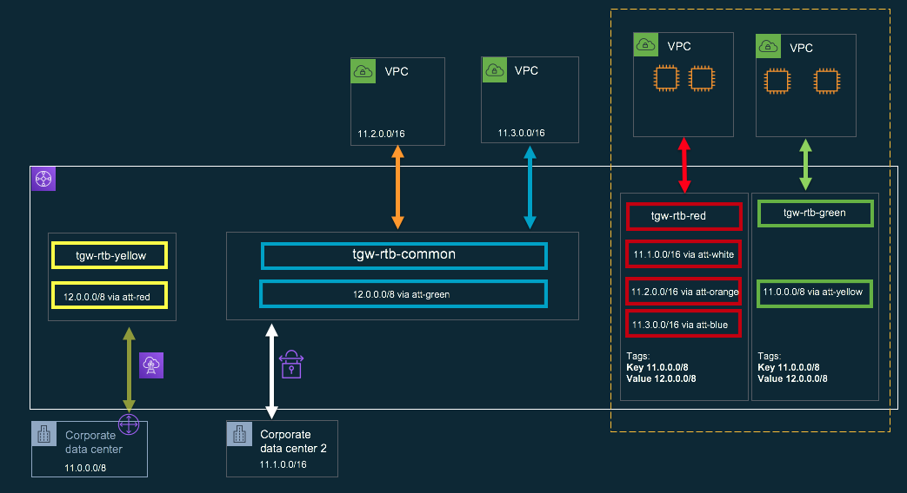

# Solution for Overlapping CIDRs using AWS Transit Gateway in VPC and NAT Instances

Author: Jaywant Kapadnis | AWS Cloud Support Engineer

Learn how you can leverage TGW to solve overlapping CIDRs problem by using Transit Gateway Routing Domains and NAT Instances. These sample scripts provides you with all the necessary tool to deploy this solution.


# License

This sample code is made available under the MIT-0 license. See the LICENSE file.

# Overview

AWS Transit Gateway gives a new way to implement HUB and Spoke Model. You have centrally managed gateway that allows you to grow your network easily and quickly. With the combination of attachment and route domain, you have wide array of options available to do VRF style routing. 
 
The solution will launch two VPCs and place two EC2 instances in each VPCs. We have two EC2 instances in different AZ to provide High Availability. The two VPCs will be mirror image of each other with regards to configuration. The idea is to provide a separate Ingress and Egress path by utilizing two different TGW Attachments and two TGW route tables.


# Implementation Details
EC2 instance will be running two scripts, health_monitor.sh and tgw_monitor.sh

`health_monitor.sh` - Two instances independently monitor each other and takeover in case of failure. Instance will send ICMP pings and if there's a failure for 3 consecutive times, it will take over and make the routing change. Once routing change is made, it will try to recover the failed instance by restarting it. There's no preempt here.

`tgw_monitor.sh` - This script is monitoring tgw route table and looking for tags added to TGW route table. `Key` would be your attachment `VPC/VPN/DX` IP CIDR and Value would be the `NAT IP` you would like to NAT to. It will add configuration to do SNAT and DNAT automatically by picking up tags from the associated route table. It will also delete any configuration if tags are removed. The script runs every 60 seconds and checks for newly added tags. This script runs on all four instances, and at any given time, all the instances are in sync. 

We'll use Linux Traffic control to do SNAT and DNAT. This will be stateless NAT configuration on these boxes. Traffic Control nat action allows us to perform NAT without the overhead of conntrack, thus giving us option to NAT large numbers of flow and addresses.

We'll use the following filter in the script:

```
tc filter add dev eth0 parent ffff: protocol ip prio 1 u32 match ip dst <NATIP> action nat ingress <NATIP> <IP2NAT>
tc filter add dev eth0 parent 1: protocol ip prio 1 u32 match ip src <IP2NAT> action nat egress <IP2NAT> <NATIP>
```

> ingress filter translates destination addresses i.e. perform DNAT.
> egress filter translates source addresses i.e. perform SNAT.
> u32 filter allows for efficient lookups of a large number of stateless NAT

# Working Details

After you launch the CF (Instruction below), it will launch the dotted section for you.



Let's look at Instance and VPC route table entries. For a given pair of overlapping CIDRs, we will use one CIDR to NAT. Given below we have two VPCs with CIDR 11.0.0.0/16. We'll NAT this CIDR to 12.0.0.0/16

### Instance and VPC Route Table Configuration:



### TGW Route Table Configuration: 



### Traffic flow

**Example: ICMP**

> VPC Orange Source IP : 11.0.0.85
> VPC Blue Destination IP: 11.0.0.28
> NATed IP: 12.0.0.28

**Forward Path: Echo Request - src ip 11.0.0.85 dst 12.0.0.28**

11.0.0.85# ping 12.0.0.28
echo request src ip 11.0.0.85 dst ip 12.0.0.28

``` 
VPC orange 11.0.0.85 → tgw-rtb-orange → tgw-attach-red → NAT instance in VPC Red [NAT translation SNAT and DNAT] src 12.0.0.85 dst 11.0.0.28 → tgw-rtb-red → tgw-att-blue → VPC Blue 11.0.0.28 
```

VPC Blue 11.0.0.28 will see packet incoming from 12.0.0.85 and hence will reply back.

**Return Path: Echo Reply - src ip 11.0.0.28 dst 12.0.0.85**

``` 
VPC Blue 11.0.0.2 → tgw-rtb-blue → tgw-attach-green → NAT instance in VPC Green [NAT translation SNAT and DNAT] src 12.0.0.85 dst 11.0.0.28 → tgw-rtb-green → tgw-att-orange → VPC Orange 11.0.0.28
```




# What you need to do?

You just need to do two things, add Tags and update TGW route tables.
1.	Add Tags to route table associated with the VPC (NAT) attachment. Ensure that you add identical Tags to the route table associated with the VPC (NAT) attachments.
	- `Key` - IP to NAT: This is the overlapping CIDR entry
	- `Value` - New IP to NAT: This is new IP that the overlapping CIDR will be NATed to.
2.	Add static route and propagated route on TGW route table
	- Select any one-member VPC from the pair of overlapping CIDR VPCs. Within TGW route table associated with that member, add static route (NATed IP) with destination as any one of the NAT VPC attachment. For the selected NAT VPC attachment, select it's associated TGW route table and propagate attachment for the second member in overlapping CIDR VPCs. Repeat the process for other pair in the overlapping VPCs
As shown in the example above:

VPC Orange and VPC Blue are overlapping with CIDR 11.0.0.0/16. We'll NAT this CIDR to 12.0.0.0/16

> VPC Orange's attachment is associated with Orange TGW route table
VPC Red's attachment is associated with Red TGW route table
VPC Green's attachment is associated with Green TGW route table
VPC Blue's attachment is associated with Blue TGW route table

- Add static route for NATed IP 12.0.0.0/16 to Orange TGW route table destination as VPC Red's attachment ID
-	Within VPC Red's TGW route table propagated VPC Blue's attachment ID

**Now repeat the same process for VPC Blue**

-	Add static route for NATed IP 12.0.0.0/16 to Blue TGW route table destination as VPC Green's attachment ID
-	Within VPC Green's TGW route table propagated VPC Orange's attachment ID

The above can be repeated for n number of VPC attachment. The configuration on VPC Red and VPC Green remain the same and process of adding static route and propagated route on respective TGW route tables remains the same.

# Instructions on how to implement this solution
## Using CloudFormation Template
Download the latest template (or clone the repo): [CF template](https://github.com/aws-samples/aws-transit-gateway-overlapping-cidrs/raw/master/cf.json)


### CF stack will launch:
- Two VPCs, Two EC2 instances in each VPC 
- Create TGW attachment for each VPC and associate it with a separate TGW route table, 
- Download Scripts from S3 bucket and configure the instances with the NAT values provided as parameter (IP2NAT and NAT IP)
   * CF allows only one pair but you can add more IPs later by updating the TGW route table tags.
- Start pushing logs from health_monitor.sh and tgw_monitor.sh scripts to CW logs.



### CloudFormation Output:



## Using existing VPCs
1.	Create an EC2 Role in AWS Identity and Access Management (IAM).
2.	Launch two Amazon Linux EC2 NAT instances into each of your VPC's private subnets in different AZ but sharing same route table with access to Internet via NAT-Gateway. Using the IAM role created to launch the instances.
3.	Disable Source Destination Check and enable IP forwarding:

```
$ sudo vi\/etc/sysctl.conf #Add the following
net.ipv4.ip_forward = 1

$ sudo sysctl -p /etc/sysctl.conf
$ sudo service network restart
```

4.	Open Security Groups for these Instances (Allow Any Ingress)
5.	Update VPC route table with the following entry:

```
NAT IP -> ENI of the NAT instance
IP2NAT -> TGW ID
```

6.	Create TGW attachment and associate this attachment with TGW route table
7.	Download and configure the health_monitor.sh and tgw_monitor.sh script.

```
$ wget https://github.com/aws-samples/aws-transit-gateway-overlapping-cidrs/raw/master/health_monitor.sh
$ chmod a+x health_monitor.sh
$ echo\'@reboot /root/health_monitor.sh >> /tmp/health_monitor.log' | crontab
$ ./health_monitor.sh >> /tmp/health_monitor.log &

$ wget https://github.com/aws-samples/aws-transit-gateway-overlapping-cidrs/raw/master/tgw_monitor.sh
$ chmod a+x tgw_monitor.sh
$ echo '@reboot /root/tgw_monitor.sh >> /tmp/tgw_monitor.log' | crontab
$ ./tgw_monitor.sh >> /tmp/tgw_monitor.log &
```

Repeat the above steps for the second VPC. If you don't want HA implemented, you can skip configuring health_monitor.sh and have only 1 Instance in each of the VPCs with tgw_monitor.sh configured, however this is not recommended approach due to single point of failure. 

### Instance IAM role permissions

````
{
    "Statement": [
        {
            "Action": [
                "ec2:DescribeInstances",
                "ec2:DescribeRouteTables",
                "ec2:CreateTags",
                "ec2:DeleteTags",
                "ec2:CreateRoute",
                "ec2:ReplaceRoute",
                "ec2:DeleteRoute",
                "ec2:StartInstances",
                "ec2:StopInstances",
                "ec2:DescribeTransitGatewayAttachments",
                "ec2:DescribeTransitGatewayRouteTables",
                "logs:Create*",
                "logs:PutLogEvents"
            ],
            "Resource": "*",
            "Effect": "Allow"
        }
    ]
}


````

# Few advance configuration examples possible with this solution

### NATing VPN and VPC attachments


### NATing VPN, VPC and DX attachments



### Few things to note

- With our testing we have noticed that you would lose 6-7 packets during instance failover.
- You can only have one TGW attachment per NAT VPC
- Use /32 prefix for NATing host IPs. Example: Name 11.2.2.2/32 Value 12.2.2.2/32
- It is recommended that you use matching prefix mask for NAT IP.
- Use higher instance size to get good throughput and performance.
- Default Instance Type for CF template is m4.large. This instance type may not be available in all the region and CF stack may fail, please select instance type accordingly.
- Please remove all Name Tags (NATPrimary, NATSecondary) if you would like to modify parameter(s) in CF stack that may result in NAT instance termination.
- Solution works for pair of overlapping CIDRs but not if you have more than 2 sites with overlapping CIDRs. Example: It will not work for 3 sites with same CIDRs.
